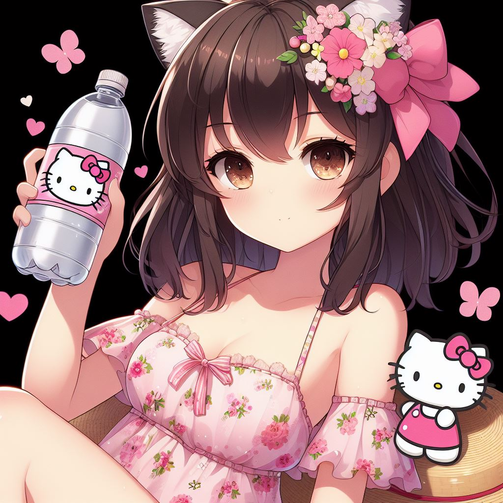

<!--   -->

# Toma Awa Bot

Fiz um bot pra poder ajudar minha esposa a tomar a quantidade certa de agua sem se esquecer. 

Sistema de lembretes pra beber agua

Como ele funciona? 

> 1. Marca a quantidade de garrafas dado o numero de registro do comando /garrafa dentro do periodo de tempo determinado.

> 2. Mostra o progresso da joranda de tomar awa durante o dia com /progressoDia.

> 3. Todo dia assim que e dado o reset no time do bot ele vai receber o comando /comecar que vai dar incio a bebedeira. 

Ao final de cada dia o bot vai dizer se a meta de agua foi batida ou nao, isso serve pra contabilizar no final de semana se o nivel de agua foi mantido ok. 